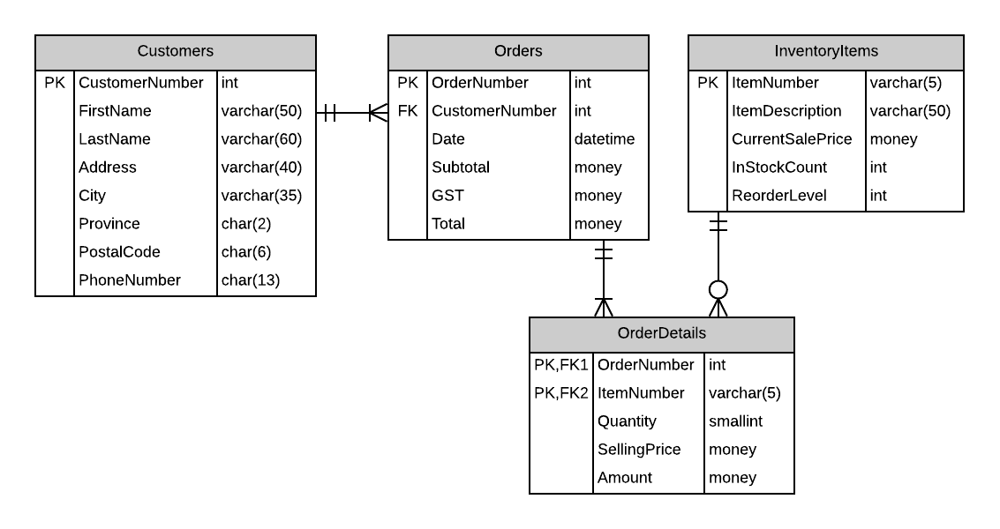
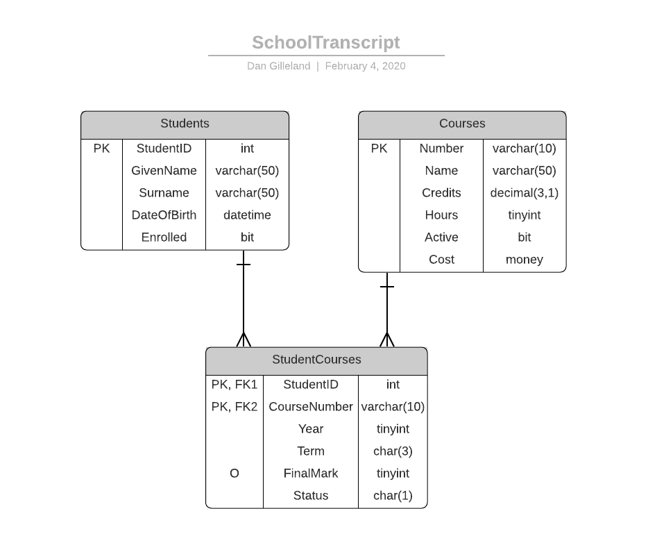

# Databases, Servers, and SSMS

- SQL Server
  - Software that runas as a *service* on the computer.
  - Multiple instances of SQL Server can be installed on the same computer.
    - Default Instance - the name of the computer, or `.` to represent the "local machine"
    - Named Instance - the name of the computer followed by the name of the SQL Server instance. e.g.: `.\SQLEXPRESS`
  - Each instance of SQL Server can manage multiple databases.
- SQL Server Management Studio (SSMS)
  - A software tool to connect to and manage SQL Server instances and their databases.

----

## Notes on Operators and Naming Standards

```sql
-- Relational Operators
-- > >= < <=
-- =    <>
-- Logical Operators
-- AND   OR    NOT
-- LIKE is used for pattern-matching
-- [A-Z] single character from A-Z inclusive
CHECK (Province LIKE '[A-Z][A-Z]')
-- [0-9] single character from 0-9 inclusive
-- BETWEEN - upper and lower bounds, inclusive
CHECK (Mark BETWEEN 0 AND 100)

-- Constraint Name Prefixes
-- PK  - Primary Key  - always clustered indexes
-- FK  - Foreign Key
-- DF  - Default
-- CK  - Check
-- UX  - Unique (Alternate Keys - AK) - always non-clustered indexes

-- Indexes
-- IX  - prefix for indexes
-- Indexes are a means of quickly referencing data by having the data sorted by the index.
-- Clustered Index refers to storing the Primary Key index column alongside the rest of the column data for the row.
-- Non-Clustered Index refers to storing an index alongside the corresponding PK index
```

----

## ESP - Spec 1



## School Transcript



